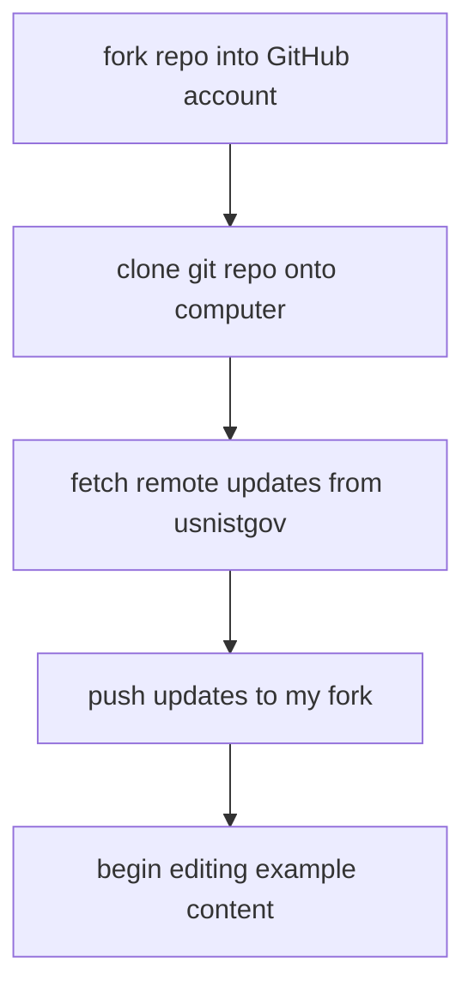
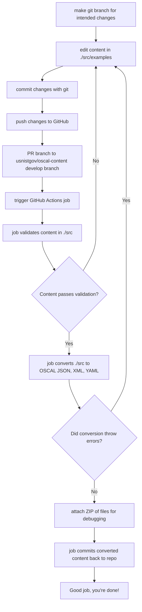

 

# OSCAL Examples

This repository contains numerous OSCAL examples in XML, JSON, and YAML formats based on the OSCAL 1.0.0 release.

Some examples are considered provisional "finished" versions of OSCAL catalogs and profiles; they are not authoritative but are intended as demonstrations of OSCAL. Other examples are works in progress. Each subdirectory within the examples directory clearly indicates the current status of its example files.

These files are maintained by a Continuous Integration and Continuous Deployment (CI/CD) process that automatically converts source content into the alternate formats found in the many subdirectories of this repository. As a result, these example files should not be modified. Instead, the source of the file should be edited in the [src](src) subdirectories.

## Contributing

### How do I set up my developer environment?

### How do I send change content to the OSCAL Team for review?

### Step-by-step instructions

1. Read the [CONTRIBUTING.md](CONTRIBUTING.md) file to understand the NIST OSCAL contribution process.
2. Fork this repository to add your contributions.
3. Make changes in the [src](src) directory.
4. Create a pull request to submit your changes and trigger the required GitHub actions to rebuild and validate the generated content in the example directories.

## Structure

The structure and contents of this repository is as follows:

- [src](src): This directory contains the source files for all the OSCAL examples located in this repository. MAKE CHANGES IN THIS DIRECTORY.
- [examples](examples): This directory contains sample OSCAL content organized by OSCAL model.
- [fedramp.gov](fedramp.gov): This directory is now deprecated, please examine [the `baselines` directory in the GSA/fedramp-automation repo](https://github.com/GSA/fedramp-automation/tree/master/dist/content/baselines) for the canonical copies of the FedRAMP catalog and baseline profiles.
- [nist.gov/SP800-53/rev4](nist.gov/SP800-53/rev4): This directory contains OSCAL examples of the catalog, and low, moderate, and high baselines defined by NIST Special Publication (SP) [800-53 Revision 4](https://csrc.nist.gov/publications/detail/sp/800-53/rev-4/final).
- [nist.gov/SP800-53/rev5](nist.gov/SP800-53/rev5): This directory contains OSCAL examples of the catalog, and low, moderate, and high baselines defined by NIST Special Publication (SP) [800-53 Revision 5](https://csrc.nist.gov/publications/detail/sp/800-53/rev-5/final[) and [SP 800-53B](https://csrc.nist.gov/publications/detail/sp/800-53b/final) respectively.
  - [nist.gov/SP800-53/rev5/draft](nist.gov/SP800-53/rev5/draft): Earlier releases of draft content for the Final Public Draft (FPD) version of the Revision 5 catalog and baselines. These drafts, are now superseded by the final versions above, and are provided for reference only.

