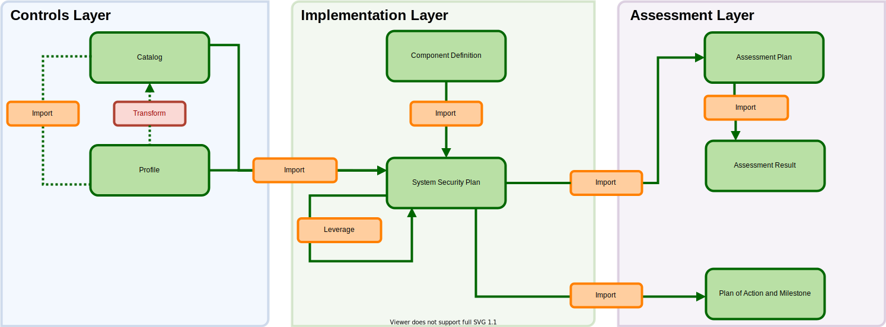

# Trace a Single Control through OSCAL

This example will demonstrate an implementation of a single control using OSCAL, and is intended for the OSCAL novice looking for a place to start.  The focus is on a minimal implementation, covering required elements of the models.

This example uses AC-8, System Use Notification.  It is important to be aware that other controls may require additional modeling work to document in OSCAL.  The learning objective for this control is to provide a very basic overview across the models without complication.  Future examples will cover additional controls with more complex examples.

# Concept

This example outlines the following models for a single control:

### Controls Layer

1. Catalog
2. Profile

### Implementation Layer

3. Component Definition
4. System Security Plan

### Assessment Layer

5. Assessment Plan
6. Assessment Result
7. Plan of Action and Milestone

# Model Files

- [XML Format](xml/)
- [JSON Format](json/)
- [YAML Format](yaml/)