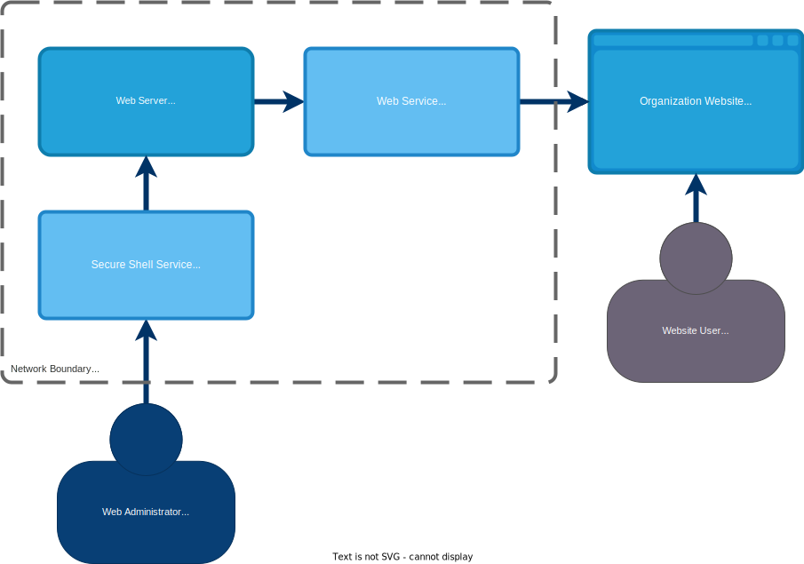

# Sample Networks - Simple

>*Note: Interations may be used to add layers and capabilities to a system.  OSCAL content developed for each iteration will build upon content created in the previous iteration.  This allows for a simple start that slowly grows in complexity.*

## System: Public Website for an Organization (Iteration 1)

### Overview

This system represents a basic organizational website, containing static HTML web pages. It is accessible to the general public. It is deployed on a cloud service provider, utilizing the security features of the provider. One server is deployed to operate as the web server, and deliver the pages on HTTP (80/tcp) and HTTPS (443/tcp). TLS is required by the organization.

Additionally, a secure shell server (22/tcp) is available that allows the web administrator to upload web content to the `/var/www/html` directory. This server is configured to operate on a private connection within the CSP's network. Connection to the SSH service requires SSH key, and password connection is disabled.

